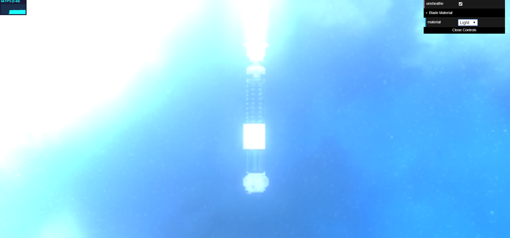

# Progetto Tolusso Raffaele 
Ho iniziato il progetto andando a cercare il soggetto che dovrà essere presentato, cercando modelli 3D sul web che potessero soddisfare le richieste principali della consegna. Ho trovato il modello del manico di una spada laser con tanto di textures per il rendering alla pagina https://free3d.com/it/3d-model/lightsabers-686170.html. Il modello non è né troppo semplice né troppo complesso a mio parere.
## Idea generale
L'idea è quella di presentare una spada la cui lama può essere fatta di diversi materiali tutti visualizzabili dal cliente, ad esempio una lama di "luce" come per ogni spada laser, ma anche ad esempio d'acqua.
## Sfondo
Ho trovato una cubemap coerente che rappresenta lo spazio con una luna alla pagina https://www.hiclipart.com/free-transparent-background-png-clipart-dcdwa/.
## Rendering Manico
Ho fatto il rendering del manico e impostato lo sfondo della scena con la cubemap e renderizzato il manico attraverso l'AO map e la funzione di rendering vista a lezione per superfici riflettenti utilizzando la roughness contenuta nella texture.
## Rendering "lama" 
Ho creato un semplice modello della lama usando blender e lo ho aggiunto alla scena.
### Materiale Acqua
Ho fatto lo shader per la versione della lama fatta d'acqua usando la funzione di rifrazione.
### Materiale Luce
Ho fatto lo shader per la classica lama "fatta di luce". Per poter creare l'effetto del laser ho prima cercato sul web possibili effetti che riproducessero l'effetto di illuminazione. Ho trovato una possibile soluzione che utilizza postprocessing chiamata "UnrealBloom". Sebbene la passata riesca ad amplificare le fonti di luce, dopo averla applicata l'intera scena perde di dettaglio e ci sono problemi con le fonti di luce sullo sfondo. 
 
Dopo aver riflettuto su come poter dare l'effetto del laser ho pensato che il colore della spada deve sempre essere "lucente" al centro quindi con una colorazione bianca per mostrare l'emissione di luce e del colore del laser ai bordi. Ho quindi pensato che una caratteristica simile nel cilindro è rispecchiata dal prodotto scalare tra la normale del vertice e il vettore che va dalla camera al punto, in quanto sarà molto alto nei punti che hanno la normale rivolta verso la camera e sempre più piccolo nei punti che hanno una normal sempre più ortogonale a vettore della camera. Ho approfittato di questa caratteristica e una volta scelto il colore del laser basta creare un colore composto dal valore così calcolato quando questo supera il valore corrispondente e il valore corrispondente a quello del colore scelto quando questo supera il prodotto. L'effetto non è esattamente perfetto e non corrisponde esattamente all'emissione di luce, ma lo trovo in ogni caso efficace
### Materiale Ferro
Ho utilizzato gli esempi visti a lezione per fare la lama di ferro utilizzando la cSpec specifica del materiale e il fragment shader visto a lezione.
